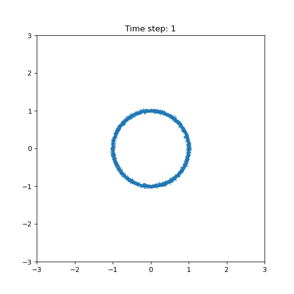

# Diffusion model tutorial

<table>
  <tr>
    <td align="center">
      <b>Forward diffusion process</b> 
      
    </td>
    <td align="center">
      <b>Reverse diffusion process</b> 
      
    </td>
  </tr>
</table>

This section provides a visual illustration of the diffusion process.
